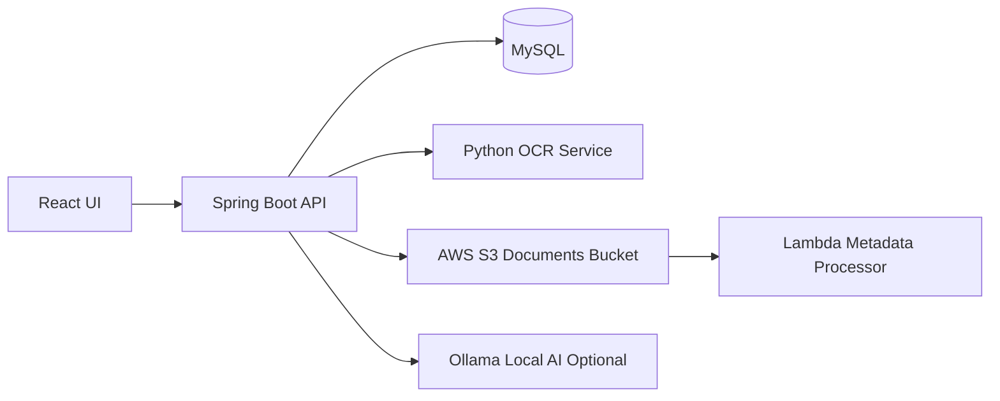

# SmartTax AI

SmartTax AI is a cloud-ready full-stack tax assistant that extracts salary and tax data from Form 16 or salary slips, calculates tax under Indian tax regimes, stores calculation history, and generates AI-style recommendations for better tax planning.

Built as a portfolio-ready project for Gowtham Boddu.

This repository is designed to match the resume project story:

- Spring Boot REST API for profiles, tax calculations, document uploads, and recommendations
- React dashboard for data entry, upload flow, results, and history
- Python OCR microservice with Tesseract-compatible extraction hooks
- MySQL persistence for user profiles, tax records, and uploaded document metadata
- AWS deployment notes for EC2, S3 lifecycle policies, Lambda processing, and GitHub Actions CI/CD
- Ollama-ready recommendation flow for open-source local AI

## Architecture



## Features

- Tax calculation for old and new regimes using configurable slab logic
- Document upload endpoint with OCR service integration
- Regex-based fallback extraction for salary, HRA, deductions, and TDS
- Recommendation engine with optional Ollama/open-source AI integration
- MySQL schema managed through JPA/Hibernate
- Local Docker Compose for MySQL
- CI workflow for backend, frontend, and OCR service checks
- Terraform sample for S3 lifecycle policy
- Lambda sample for serverless document event processing

## Quick Start

### 1. Start MySQL

```bash
docker compose up -d mysql
```

### 2. Run OCR service

```bash
cd ocr-service
python -m venv .venv
.venv\Scripts\activate
pip install -r requirements.txt
uvicorn app.main:app --reload --port 8001
```

### 3. Run backend

```bash
cd backend
mvn spring-boot:run
```

### 4. Run frontend

```bash
cd frontend
npm install
npm run dev
```

Open the frontend at `http://localhost:5173`.

## Environment Variables

Backend:

```env
SPRING_DATASOURCE_URL=jdbc:mysql://localhost:3306/smarttax
SPRING_DATASOURCE_USERNAME=smarttax
SPRING_DATASOURCE_PASSWORD=smarttax
OCR_SERVICE_URL=http://localhost:8001
OLLAMA_URL=http://localhost:11434
OLLAMA_MODEL=llama3.2
```

OCR service:

```env
TESSERACT_CMD=
```

The backend returns deterministic rule-based recommendations by default. It is prepared for local open-source AI through Ollama, so the project does not depend on paid APIs.

Optional Ollama setup:

```bash
ollama pull llama3.2
ollama serve
```

## API Overview

- `POST /api/profiles` - create or update a user profile
- `GET /api/profiles/{id}` - fetch profile
- `POST /api/tax/calculate` - calculate tax and save result
- `GET /api/tax/history/{profileId}` - calculation history
- `POST /api/documents/upload` - upload a document and extract values through OCR
- `POST /api/recommendations` - generate tax recommendations

## GitHub Deployment Story

This repo includes `.github/workflows/ci.yml` for validation. A production pipeline can extend it with:

1. Build backend JAR and frontend static assets.
2. Upload artifacts to EC2 or container registry.
3. Deploy backend to EC2.
4. Upload frontend build to S3 or serve via Nginx on EC2.
5. Apply Terraform for S3 lifecycle and Lambda document metadata processing.

See [docs/aws-deployment.md](docs/aws-deployment.md) for a practical deployment checklist.

## Push To GitHub

```bash
git init
git add .
git commit -m "Build SmartTax AI full-stack project"
git branch -M main
git remote add origin https://github.com/Gowtham0408/smarttax-ai.git
git push -u origin main
```

## Disclaimer

This is an educational portfolio project. Tax calculations are simplified and should be reviewed before real-world financial use.
